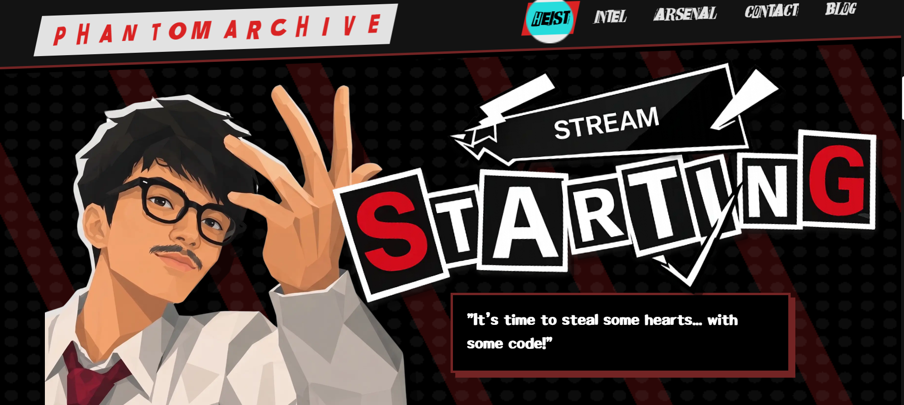

# Jawad's Web Portfolio

Welcome to the repository for my personal web portfolio! This project showcases my skills, experience, and the latest projects I've been working on.

## 🚀 Preview

## 🛠️ Tech Stack

This portfolio is built using modern web technologies to ensure optimal performance, beautiful animations, and an excellent user experience.

- **Frontend Framework:** [React](https://reactjs.org/) (v19)
- **Build Tool:** [Vite](https://vitejs.dev/)
- **Styling:** [Tailwind CSS](https://tailwindcss.com/) (v4)
- **Animations:** [Framer Motion](https://www.framer.com/motion/)
- **Smooth Scrolling:** [Lenis](https://lenis.studiofreight.com/)
- **Backend / Database:** [Supabase](https://supabase.com/)

## 🌐 Live Access

You can access and view the live version of this portfolio here:
👉 **[https://jawad-portofolio.vercel.app](https://jawad-portofolio.vercel.app)**

## 📜 License

Distributed under the MIT License.
